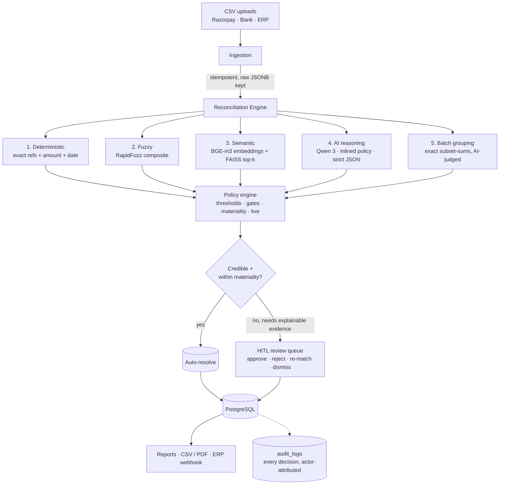

# RECONX — AI Finance Controller

**Reconciling Razorpay settlements vs. bank statements vs. your ERP — in one
pipeline, with an AI that decides *and* shows its work.**

Every fintech company spends nights reconciling money. Gateway settlements
don't match bank credits. Payouts arrive aggregated. Refunds reverse
settlements weeks later. Somebody opens five tabs and a spreadsheet and
painstakingly decides "this one goes with that one." RECONX replaces that
spreadsheet with a tiered AI pipeline and a human-in-the-loop console that
never lets money silently disappear.

---

## Why this is interesting

Most reconciliation tools stop at "did the amounts add up?" RECONX is built
around a different, finance-first belief: **a match you can't explain is a
match you shouldn't trust.** So every decision — automated *or* human — is
reasoned, gated, and audited:

- **A staged match pipeline, weakest to strongest** — deterministic identity
  → fuzzy text/amount → semantic embeddings → AI reasoning that *explains*
  each call in natural language before it's allowed anywhere near a ledger.
- **A joint-evidence gate.** Similarity alone never resolves. An AI "match"
  auto-resolves only when it clears *both* a confidence threshold *and* a
  semantic-similarity floor pinning the claim to real evidence. Below the
  floor, it goes to a human with its reasoning attached.
- **Aggregated payout handling that doesn't guess.** When a bank rolls many
  gateway credits into one "AGGREGATED PAYOUT," RECONX enumerates exact
  subset-sums, then asks the AI whether the sum is a *genuine* payout or a
  *coincidence*. Sum equality alone never auto-resolves — an unexplained
  exact sum is escalated, not confirmed.
- **Nothing can silently disappear.** Every unmatched record becomes a
  clearly-typed exception in a review queue. Every AI evaluation writes a
  full `ai.decision` audit row (rationale, model, candidate similarities).
  Every human action writes an audited, actor-attributed event. The audit
  trail is the product, not the paperwork.

---

## The pipeline



Every threshold is a database row that takes effect on the *next run* — no
redeploys to change matching behavior. Auto-resolve is gated by confidence
*and* materiality; high-value items are always forced to a human.

---

## What it ships

| Capability | What it actually does |
| --- | --- |
| **AI Analysis, off the critical path** | Opening an exception returns instantly; the reasoning agent streams its classification in the background and the analysis is cached once per item. |
| **Human-in-the-loop queue** | Unified open exceptions + proposals, sortable/filterable, side-by-side source records, one-click manual matching — every action audited. |
| **Live policy engine** | Thresholds, semantic floor, materiality, force-human limits — edited in a validated admin UI, audited per change, effective next run. |
| **Money-first reporting** | CSV exception ledgers + formatted PDF finance summaries (auto/human split, match-rate by source, aging buckets), dated and audited. |
| **ERP push-back webhooks** | Collected resolution results POSTed with up to 3 retries + exponential backoff; durable delivery ledger; mock receiver for demos. |
| **Analytics console** | Daily trend charts (matches, auto vs. human, rejections, exception flow) from a zero-filled metrics feed. |
| **Honest offline mode** | Hermetic `heuristic`/`hashing` doubles make the whole demo + 136-test suite run without a GPU, while the same code path drives real BGE-m3 + Qwen 3 over Ollama. |

---

## Tech stack

| Layer | Choice |
| --- | --- |
| Backend | Python 3.11 · FastAPI · SQLAlchemy 2 async (asyncpg) |
| Matching | RapidFuzz · BGE-m3 embeddings (Ollama) · FAISS vector index |
| Reasoning | Qwen 3 (Ollama) with strict-JSON contract + deterministic fallback |
| Data | PostgreSQL 16 · JSONB raw payloads · NUMERIC money · `audit_logs` |
| Frontend | Vite · React · TypeScript · Tailwind v4 · Recharts · shadcn primitives |
| Delivery | Docker Compose (db · backend · frontend, optional `ollama` profile) |

---

## Run it (2 minutes)

Prereq: Docker Desktop with Compose v2. No Python or Node on your host.

```bash
cp .env.example .env
docker compose up --build
```

| URL | What |
| --- | --- |
| http://localhost:5173 | RECONX console |
| http://localhost:8000/docs | OpenAPI / Swagger |
| http://localhost:8000/healthz | Liveness (compose healthcheck) |

Load the demo dataset and press **Run reconciliation** in the dashboard:

```bash
curl -sS -X POST http://localhost:8000/api/v1/uploads -F "source=razorpay" -F "file=@backend/sample_data/razorpay_settlements.csv"
curl -sS -X POST http://localhost:8000/api/v1/uploads -F "source=bank" -F "file=@backend/sample_data/bank_statement.csv"
curl -sS -X POST http://localhost:8000/api/v1/uploads -F "source=erp" -F "file=@backend/sample_data/erp_transactions.csv"
```

**The demo story to tell:** auto-resolved matches land in
`audit_logs` with full rationale; an aggregated payout is *not* fabricated
into a match; a refund surfaces its original settlement as a read-only
reference; and every exception opens with an AI analysis that explains *why*
the hold happened. Then approve / reject / match from the drawer and watch
the decision appear in Reports, the ERP webhook, and the audit trail.

Demo fixtures: `backend/sample_data/*.csv` + locked ground-truth
`*_test.csv` files (see `docs/architecture.md`).

---

## API surface (v1)

| Area | Endpoints |
| --- | --- |
| Health & sources | `GET /health`, `/sources` |
| Ingestion | `POST /uploads`, `GET /ingestions`, `GET /transactions` |
| Pipeline | `POST /reconciliation/run` |
| Matches & exceptions | `GET /matches`, `GET /exceptions` |
| HITL review | `GET /review-queue`, `GET /review-queue/{exceptions,matches}/{id}`, `GET .../exceptions/{id}/analysis`, `POST /review/matches/{id}/approve\|reject`, `POST /review/matches/manual`, `POST /review/exceptions/{id}/dismiss\|escalate` |
| Policy engine | `GET/PATCH /policy[/{key}]`, `GET /policy/{key}/history` |
| Reporting | `GET /reports/{summary,export.csv,export.pdf}?from&to` |
| ERP integration | `POST /integrations/erp/push`, `GET /integrations/erp/deliveries`, mock receiver at `/mock/erp/webhook` |
| Analytics | `GET /analytics/overview?from&to` |
| Audit trail | `GET /audit?actor&action&entity_id` |

Every mutating endpoint accepts `X-Actor` (falls back to `DEFAULT_ACTOR`);
every call lands in `audit_logs`.

---

## The traceability contract

Nothing is trusted in memory; everything is written down.

- `audit_logs` captures **actor, action, entity, before/after state,
  structured details, request id** for every state-changing event.
- Every semantic + AI evaluation writes an `ai.decision` row with the full
  rationale text, model name, and all candidate similarities — rejected
  candidate sets stay inspectable forever.
- Policy changes write `policy.updated` with before/after values and actor.
- A crashed run can't leak overridden policy: tests restore canonical values.

## Configuration

Environment lives in `.env` (see `.env.example`): Postgres credentials,
model providers (`EMBEDDING_PROVIDER` / `REASONING_PROVIDER` —
`hashing`/`heuristic` for hermetic doubles, `ollama` for real BGE-m3 /
Qwen 3), semantic index path, CORS, `ERP_WEBHOOK_URL`. Runtime tunables
(thresholds, gates, materiality) live in the database, edited from the
Policy screen — never hardcoded, never bypassing audit.

Local bare-metal dev (optional): Python 3.11+ / Node 20+.

```bash
cd backend && pip install -r requirements.txt
export POSTGRES_HOST=localhost POSTGRES_USER=recon \
       POSTGRES_PASSWORD=... POSTGRES_DB=reconciliation
uvicorn app.main:app --reload

cd ../frontend && npm install && npm run dev   # proxies /api -> localhost:8000
```

---

## Testing — 136 tests, locked ground truth

```bash
docker compose exec backend python -m pytest -q
```

Included: parser/date invariants; **golden ground-truth acceptance** (locked
per-ref outcomes on real datasets); reconciliation **idempotency** (global
counters must not grow across repeated runs); the joint-evidence gate
regression; review-action workflows with audit assertions; policy
validation + admin-change→matcher-behavior proof; report content (CSV rows,
PDF magic bytes, range filtering); webhook delivery + retry/failure
auditing; batch grouping (aggregated-payout stays open, exact-sum without
corroboration never auto-resolves); analytics bucketing and zero-fill.

> Note: tests run against the shared dev database and human decisions made
> inside tests persist by design — they are real audited events.

## Repository layout

```
├── backend/
│   ├── app/
│   │   ├── api/            routers (/api/v1) incl. review, policy, reports,
│   │   │                   integrations, analytics
│   │   ├── core/           settings (env), logging w/ request-id context
│   │   ├── db/             async engine/session, declarative base
│   │   ├── models/         SQLAlchemy models mirroring init.sql
│   │   ├── schemas/        Pydantic request/response models
│   │   ├── services/       parsers, semantic (embeddings/index/matcher),
│   │   │                   reasoning (ollama/heuristic agents),
│   │   │                   reconciliation/engine, review, policy_admin,
│   │   │                   reports (reportlab), webhook, analytics, audit
│   │   └── main.py         app assembly, middleware, mock ERP receiver
│   ├── tests/              136-test suite incl. golden acceptance + regressions
│   ├── sample_data/        demo CSVs + golden *_test.csv fixtures
│   └── Dockerfile
├── frontend/               Vite + React + TS + Tailwind v4 + shadcn primitives
│   └── src/
│       ├── pages/          Dashboard (Recharts) · Review queue · Policy ·
│       │                   Reports · Data sources
│       ├── components/     ReviewDrawer, analytics charts, ui primitives
│       └── api/client.ts   typed client, actor header, blob downloads
├── docker/postgres/init.sql   schema source of truth + policy seeds
├── docs/                   architecture (per-phase status), data formats
└── docker-compose.yml      db · backend · frontend (--profile models: ollama)
```

Docs: [Architecture](docs/architecture.md) · [Source file formats](docs/data-formats.md)

---

## Status

All phases delivered: foundation · deterministic + fuzzy · semantic + AI
reasoning · HITL review · policy/reporting/webhooks · analytics ·
**batch grouping (Phase 7)** — including gold-standard evaluation of the
real-model path (BGE-m3 + Qwen 3) and latency engineering on the review
drawer.

**Next on the roadmap:** real auth replacing `X-Actor`, a reconciliation
scheduler with evented triggers, multi-entity tenancy, and a "what if"
policy simulator.