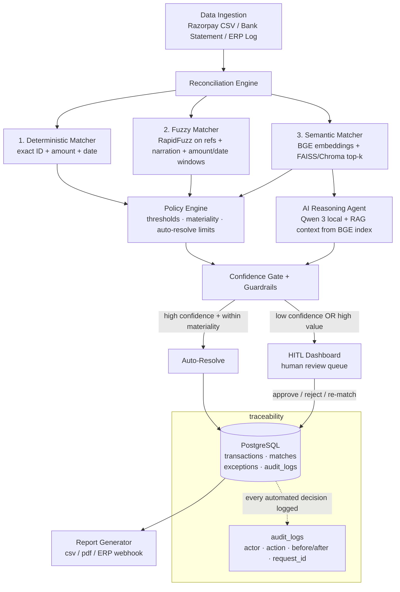
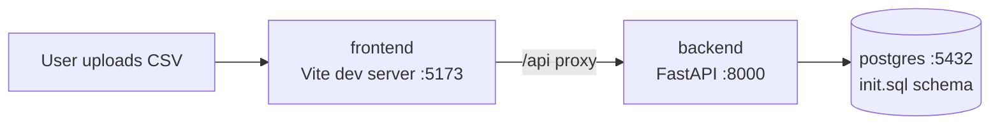
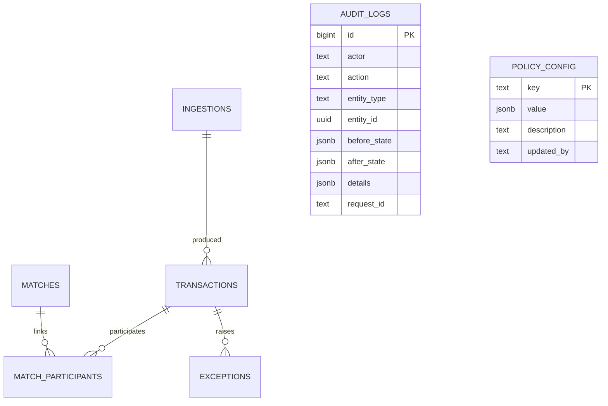

# Architecture

## Phase 4 status: human-in-the-loop review (implemented)

Review actions live in one service module (`app/services/review.py`) used by
`/api/v1/review/*` routes. There is no parallel "human path" in the data
model: humans set exactly the fields the pipeline sets (`matches.status`,
`resolved_by='human'`, `decided_by`, `resolved_at`; exceptions
`status/assigned_to/resolution_note/resolved_at`). Every action writes an
audit row with actor + before/after state.

Endpoints:

- `GET /api/v1/review-queue` — unified queue of open/in_review/escalated
  exceptions AND proposed matches. Filters: `item_type`, `status`,
  `exception_type`, `priority`; sorting: `sort_by=amount_impact|opened_at`
  with `order=asc|desc`. Exception-scoped filters exclude proposals unless
  `item_type` is explicit.
- `GET /api/v1/review-queue/exceptions/{id}` — full record (raw payload),
  linked proposed matches, and ranked unclaimed counterpart candidates
  (text 0.4 + amount-proximity 0.4 + same-day 0.2; confirmed members are
  never offered).
- `GET /api/v1/review-queue/matches/{id}` — participants with raw payloads.
- `POST /api/v1/review/matches/{id}/approve|reject` — proposed-only (409
  otherwise). Approve resolves open pipeline exceptions on the
  participants; reject leaves them open.
- `POST /api/v1/review/matches/manual` — creates a `manual`, `confirmed`,
  `human` match from ≥2 transaction ids; refuses to double-book any
  transaction already in a confirmed match (409); optionally supersedes a
  proposal (`replace_proposed_match_id`, which is rejected + audited).
- `POST /api/v1/review/exceptions/{id}/dismiss|escalate`.
- `GET /api/v1/dashboard/summary` — counts for the dashboard cards.
- `GET /api/v1/audit?actor=&action=&entity_type=&entity_id=` — read model.

Audit action taxonomy added in Phase 4: `match.approved`,
`match.rejected`, `match.manual_created`, `exception.resolved`,
`exception.dismissed`, `exception.escalated`.

Frontend console adds Dashboard / Review queue / Ingest tabs, an actor
field (persisted to localStorage, sent as `X-Actor`), the sortable +
filterable queue table, and the detail drawer (side-by-side source records,
prominent AI rationale block for ai/semantic proposals, ranked candidates
with one-click manual matching, decision note field).

Known operational note: the pytest suite runs against the shared dev
database and human decisions made by tests persist afterwards (by design —
they are real audited decisions). Re-running reconciliation respects them:
confirmed members are immutable inputs, so their former partners open as
`unmatched`. To reset the golden demo state, delete matches/participants/
exceptions touching the demo refs and re-run the pipeline.

## Phase 5 status: policy admin, reporting, ERP webhook (implemented)

### Policy engine admin
- `GET /api/v1/policy` — every `policy_config` row enriched with presentation
  metadata (`app/services/policy_admin.py`): group ("Matching thresholds",
  "Auto-resolve gates", "Materiality rules", "Batch grouping"), human label,
  description, unit, type, plus last-change attribution read from audit.
- `PATCH /api/v1/policy/{key}` — validated update. A per-key validator
  registry (ranges/types/bools) rejects broken configs with HTTP 400;
  unregistered keys are read-only by design. No-op saves are detected and
  skip auditing. Every real change writes a `policy.updated` audit row with
  before/after values and actor.
- `GET /api/v1/policy/{key}/history` — per-key change history from
  audit_logs (JSONB details containment).
- Matchers read policy live on each run; tests prove an admin-API threshold
  change alters matcher output on the next run (blocked → unmatched vs
  allowed → manual_review_required).
- UI: Policy tab renders grouped cards with inline editing, validation
  errors, save-per-field, "last changed by X at Y", expandable history.

### Reporting
- `GET /api/v1/reports/summary|export.csv|export.pdf?from=&to=` — date-range
  scoped (inclusive, ISO dates). CSV = full exception ledger with resolution
  status; PDF (reportlab) = formatted finance summary: totals,
  auto/human split, match-rate by source, exception aging buckets, top
  exception types. Every generation writes a `report.generated` audit row.
- Frontend Reports tab: presets (this week / last 7 days / this month /
  all-time / custom), blob download with actor header, summary preview cards.

### ERP webhook
- `POST /api/v1/integrations/erp/push {url?, since?, until?}` — collects
  resolved results (confirmed/rejected matches with member refs +
  auto/human resolution type; closed exceptions) and POSTs them with up to
  3 attempts and exponential backoff. Target defaults to env
  `ERP_WEBHOOK_URL`; failures raise HTTP 502 after writing a
  `webhook.failed` audit entry (attempts + errors). Successes write
  `webhook.delivered`.
- `GET /api/v1/integrations/erp/deliveries` — durable delivery ledger from
  audit_logs.
- Mock receiver at `/mock/erp/webhook` (in-memory ring buffer, dev only;
  the audit ledger is the durable record) plus GET/DELETE
  `/mock/erp/webhook/received`.
- Tests inject `httpx.MockTransport` into the delivery engine for
  retry/failure determinism and use a real local socket server for the
  endpoint-level happy path.

## Phase 6 status: analytics dashboard (implemented)

- `GET /api/v1/analytics/overview?from&to` (`app/services/analytics.py`):
  daily buckets (zero-filled, continuous) of matches created, auto/human
  resolutions, rejections, exceptions opened/closed; plus in-range
  breakdowns by match type and auto-vs-human split. Default window: last 30
  days.
- Dashboard tab now renders four Recharts views over that feed: match
  decisions (stacked areas + rejected line), exception flow (bars),
  auto-vs-human donut with center total, and per-matcher horizontal bars —
  all styled from the design system (semantic tones: emerald=auto,
  violet=human/semantic-AI, rose=rejected, amber=exceptions).
- Bug fixed during Phase 6: the pipeline never set `matches.resolved_at`
  for auto-resolves (Phase 2 relic), silently zeroing every "auto-resolved
  today" metric. Engine now stamps it; existing rows backfilled via SQL
  (resolved_at = proposed_at); regression-pinned by the analytics test.

## System flow (target state)

## Phase 1 topology (current)

| Service  | Image / base        | Port | Notes                                          |
| -------- | ------------------- | ---- | ---------------------------------------------- |
| frontend | node:20-alpine      | 5173 | Vite dev server, `/api` proxied to backend     |
| backend  | python:3.11-slim    | 8000 | FastAPI + SQLAlchemy 2 async (asyncpg)         |
| db       | postgres:16-alpine  | 5432 | Schema bootstrapped from `docker/postgres/init.sql` |

## Data model

Conventions:

- Money is `NUMERIC(18,2)` in major units (INR), always unsigned; the
  `direction` column (`credit`/`debit`) carries the sign semantics.
- Every source row is normalized into `transactions` with a canonical shape
  (`external_ref`, `amount`, `direction`, `txn_date`) while the untouched
  original row lives in `raw JSONB`. Normalization rules are documented in
  [`data-formats.md`](./data-formats.md).
- `(source, external_ref)` is unique — re-uploading a file is idempotent;
  duplicates are skipped and counted, never silently overwritten.

## Match-stage scope decisions

**Pairwise stages are strictly 1:1.** The Phase 2 deterministic and fuzzy
matchers each bind at most one record per side. Many-to-one cases — e.g.
gateway payouts aggregated by the bank into one credit such as
`UTR888150260806` ("AGGREGATED PAYOUT", ₹1,22,701.95) — are **not** handled
by fuzzy/semantic guesswork:

1. A dedicated **batch grouping stage** (`match_type='batch'`) runs **after**
   every pairwise stage *and* the semantic/AI stage, consuming only records
   those stages left unmatched (per product decision; this supersedes the
   earlier plan of running it before semantic). Candidate generation is a
   pure subset-sum function (`batch_candidate_groups`): exact/tolerant sums
   over unmatched razorpay/ERP credits within
   `matching.batch.date_window_days` of an unmatched bank credit, capped at
   `matching.batch.max_components` with tolerance
   `matching.batch.amount_tolerance_pct`. Arithmetic is cheap, exact, and
   fully auditable; the AI agent then judges whether a candidate is a
   *genuine* aggregated payout vs a coincidental sum.
2. **Sum-matching alone never auto-resolves.** Candidate groups are routed
   through the same AI reasoning layer and dual confidence/materiality gate
   as every other stage (see Phase 7). A suspiciously-exact sum with no
   corroborating signal is escalated to human review, never confirmed.
3. **Nothing can silently disappear.** After all stages run, any still-
   unmatched record is exceptioned. Every candidate group evaluated by the
   batch stage writes an `ai.decision` audit row carrying the full candidate
   set, so rejected candidate sets stay inspectable; when every group for a
   bank is rejected, the bank lands as an `unmatched` exception naming the
   evaluated candidate sets.

## Traceability contract (non-negotiable #1)

Every state-changing event writes to `audit_logs` with actor, action,
entity reference, before/after state, structured details, and the
`X-Request-Id` propagated through logs.

Current action taxonomy:

| Action                | Actor       | Trigger                          |
| --------------------- | ----------- | -------------------------------- |
| `ingestion.completed` | user/system | successful CSV upload            |
| `ingestion.failed`    | user/system | upload rejected (no data rows)   |

| Action                | Actor       | Trigger                          |
| --------------------- | ----------- | -------------------------------- |
| `ingestion.completed` | user/system | successful CSV upload            |
| `ingestion.failed`    | user/system | upload rejected (no data rows)   |
| `match.auto_resolved` | user/system | complete group passed gates      |
| `match.proposed`      | user/system | incomplete/held group persisted  |
| `exception.opened`    | user/system | unmatched or amount_mismatch     |
| `ai.decision`         | system      | every semantic+AI evaluation: full rationale text, model name, all candidate similarities |

Planned (Phases 4–5): `match.rejected`, `exception.approved`,
`exception.rematched`, `exception.escalated`,
`policy.updated`.

## Phase 3 status: semantic matching + AI reasoning (implemented)

After the deterministic/fuzzy stages, records still unmatched enter the
semantic stage:

1. **Embeddings & index** — unmatched transactions are embedded
   (`EMBEDDING_PROVIDER`: production `ollama` serving a BGE model;
   offline/test double `hashing`) and added **incrementally** to a
   persistent FAISS `IndexIDMap2(FlatIP)` over L2-normalized vectors
   (cosine), with a JSON sidecar mapping external ids to transactions and
   opportunistic compaction of stale entries. Amount/date are metadata,
   never embedded.
2. **Candidate retrieval** — top-k (`matching.semantic.top_k`) cross-source
   neighbours above `matching.semantic.similarity_threshold`. Similarity
   alone NEVER resolves: candidates are proposals only.
3. **AI reasoning agent** — each transaction with candidates goes to the
   reasoning provider (`REASONING_PROVIDER`: `ollama` serving Qwen 3, or
   the deterministic offline `heuristic` double used by the test suite)
   with policy rules inlined in the prompt. The agent returns strict JSON:
   `{decision: match|no_match|needs_human, confidence, rationale}`.
   Unparseable or failed model calls fall back to `needs_human` with the
   error preserved — fail-safe toward humans.
4. **Dual gate (unchanged)** — `match` auto-resolves only if confidence ≥
   `gate.ai_min_confidence_autoresolve` AND the amount discrepancy passes
   both materiality limits; otherwise it lands as `low_confidence_ai` /
   `amount_mismatch` exception. `needs_human` lands as
   `manual_review_required`. `no_match` flows to the sweep. Every
   evaluation writes an `ai.decision` audit row containing the full
   rationale text.

Auto-resolve completeness rule: a group must span the gateway+books core
(`razorpay` + `erp`); the bank leg attaches whenever the statement arrives.
Many-to-one batch grouping is implemented as candidate generation feeding
THIS reasoning layer (see **Phase 7**), so uncertain batch sums arrive here
with human-readable rationales rather than resolving automatically.

**Verified status.** The real (non-double) path — `EMBEDDING_PROVIDER=ollama`
(bge-m3) + `REASONING_PROVIDER=ollama` (qwen3:0.6b) — has been exercised
end-to-end against the live stack: a scoped run made real bge-m3 1024-d
embeddings (FAISS rebuilt at the true dimension) and recorded three genuine
`ai.decision` audits labelled `model=ollama:qwen3:0.6b`, auto-resolving two
matches at confidence 1.0 within ~11 s. Notes from that work:

- Docker-hosted Ollama proved unreliable on this machine (engine freezes and
  manifest digest mismatches during `ollama pull`); the working configuration
  is a **host-native** Ollama install reached from containers via
  `http://host.docker.internal:11434`. To instead use the compose `ollama`
  service, set both API URLs to `http://ollama:11434` and run
  `docker compose --profile models up -d ollama` (documented in `.env`).
- Real-model outcomes can legitimately differ from the hermetic test doubles
  (`heuristic`/`hashing`), which validate plumbing, not LLM judgement — e.g.
  in one scoped run the live model auto-resolved an ERP↔razorpay pair the
  heuristic double had proposed for human review.
- `FaissVectorIndex` derives the index dimension from the actual embedding
  matrix rather than `provider.dim`, which `OllamaEmbedder` legitimately
  reports as `0` until the first request returns. It also probes dimensionality
  when every requested transaction is already indexed, so a persisted index
  built by one embedder (e.g. the 512-d hashing double) self-heals when the
  live provider (bge-m3, 1024-d) runs next.

**Joint-evidence auto-resolve gate (implemented).** An AI `match` only
auto-resolves when it clears BOTH the confidence threshold and
`matching.ai.similarity_autoresolve_min` (0.60): the cosine similarity of the
chosen candidate must tie the claim to specific evidence. Below the floor, even
a high-confidence `match` is routed to `manual_review_required` (audited with
`auto_resolve_blocked_by: "similarity_autoresolve_min"`, rationale/confidence
preserved for the reviewer). Regression-pinned in
`tests/test_similarity_gate_regression.py`; live verification on the real path
reproduced the original overconfidence scenario with qwen3:0.6b — the weak
pair's `match` (confidence 0.9, similarity 0.571) is now blocked while the
genuine pair (0.6644) still auto-resolves. Test suites reset semantic policy to
the canonical values defined in `docker/postgres/init.sql` after every test, so
a crashed run cannot leak overridden policy into the live DB.

**qwen3:4b comparison (measured, not adopted).** On this machine qwen3:4b is
decisively slower (~250-300 s per decision, and it hit the 300 s timeout twice
in fresh runs) and is threshold-aware: at canonical similarity 0.82 its temp-0
decision correctly declined the weak pair, and its sampled rationales were
diagnostically better than 0.6b's (the lone `match` correctly cited the
₹0.90/fee-class difference). With the gate in place the 0.6b overconfidence is
contained, so the latency cost is not justified here.

## Phase 2 status: deterministic + fuzzy (implemented)

`POST /api/v1/reconciliation/run` (optional `transaction_ids` scope)
executes the pipeline synchronously:

1. **Policy snapshot** — every threshold is read live from
   `policy_config` at run start; nothing is hardcoded.
2. **Deterministic pairing** — razorpay↔ERP on exact `payment_ref`
   (amount must equal gross *or* settled; date within window),
   razorpay↔bank on exact `utr == ref_no`. Duplicate ERP claims on one
   payment_ref are flagged as conflicts, never silently disambiguated.
3. **Fuzzy augmentation** — incomplete pairs seek their missing third
   party among unconsumed singles using RapidFuzz token similarity over
   narrations combined with amount/date components (weights 0.55/0.35/0.10);
   proposals require the composite score to clear
   `matching.fuzzy.score_threshold`.
4. **Confidence gate + materiality gate** — only groups spanning all
   three sources auto-resolve (`status='confirmed'`,
   `resolved_by='auto'`, confidence = weakest leg). The money-side
   discrepancy (`Σ gateway credits vs bank credit`) must satisfy both
   `materiality.max_abs_discrepancy_inr` and
   `materiality.max_discrepancy_pct`, else the group is held as proposed
   with an `amount_mismatch` exception.
5. **Exception sweep** — every remaining non-inert record lands as a
   clearly-typed exception; bank debits (charges) are inert by policy.

Re-runs are idempotent per scope: previously confirmed matches are
immutable inputs; proposed matches and open unmatched/amount_mismatch
exceptions are rebuilt from scratch.

Actor identity: until real auth lands, mutating endpoints accept an
`X-Actor` header (default from `DEFAULT_ACTOR`). The audit schema needs no
migration when auth replaces it.

## Phase 7 status: many-to-one batch grouping (implemented)

The batch stage closes the last structural gap: gateway settlements
aggregated by the bank into a single credit. It is a **5-part stage**:

1. **Candidate generation (pure)** — `batch_candidate_groups(bank,
   components, policy)` enumerates subset-sums of unmatched razorpay/ERP
   credits within `matching.batch.date_window_days` of an unmatched bank
   credit, tolerating `matching.batch.amount_tolerance_pct` and capping at
   `matching.batch.max_components`. Pools and result sets are bounded
   (`_BATCH_POOL_LIMIT`, `_BATCH_MAX_GROUPS`); groups are ranked by
   fewest components, then smallest residual. Generation is decision-
   neutral — the AI decides, not the arithmetic.
2. **AI reasoning** — the shared agents gain `decide_batch(bank,
   components, policy)` with a batch-specific prompt
   (`build_batch_prompt`: policy rules, bank block, full component blocks,
   sum/residual/date-spread). Heuristic offline rules: exact sum +
   batch-narration wording + single component source → `match`
   (confidence 0.93 for n≥3, 0.91 for n=2); any residual → `needs_human`
   (unexplained fees); partial corroboration → `needs_human` 0.60;
   exact-but-coincidental (no signal) → `needs_human` 0.50. **Sum equality
   without corroboration is a coincidence risk, never an auto-resolve.**
3. **Dual gate** — `evaluate_ai_route` reuses the confidence +
   materiality gates; additionally, a bank credit at/above
   `review.force_human_above_inr` is force-demoted from auto-resolve to
   `needs_human` (batch-stage-local; earlier stages predate the threshold).
4. **Persistence** — outcomes use the existing `matches` +
   `match_participants` model with `match_type='batch'`: the bank credit is
   the `primary` participant, components are `participant`. Auto-resolve →
   status `confirmed`, `resolved_by='auto'`; otherwise the group persists
   `proposed` and the bank raises `manual_review_required` /
   `low_confidence_ai` / `amount_mismatch`. Rejected candidate sets are
   never silently dropped — every evaluated group writes an `ai.decision`
   audit row with the full candidate set, sum, residual, decision,
   confidence and rationale, and an all-rejected bank lands as an
   `unmatched` exception naming the evaluated sets. Scope-local
   idempotency is unchanged (proposed reclaimed, confirmed immutable).
5. **Summary contract** — `RunResponse` gains `batch_candidates_generated`,
   `batch_ai_evaluated`, `batch_auto_resolved`, `batch_proposed`,
   `batch_no_match`.

**Real case outcome (locked):** `UTR888150260806` (₹1,22,701.95,
"AGGREGATED PAYOUT", 2026-08-07) has *no* exact subset of leftover
components in its window (verified by brute force and by the running
pipeline: `batch_candidates_generated=0`). It therefore remains an open
`unmatched` exception (priority `critical`; ≥ force-human threshold) and is
never fabricated into a match. `tests/test_batch_stage.py` pins this, the
confirmed-batch happy path, the no-auto-on-sum coincidental path, and the
stage's strict idempotency.

## Policy engine placement (Phases 2–5)

The `policy_config` table is seeded with every threshold the matching
stages will consume (`matching.*`, `gate.*`, `materiality.*`,
`review.force_human_above_inr`). Matchers read policy at runtime —
threshold changes take effect without redeploying code. Auto-resolve will be
gated conjunctively: **confidence ≥ threshold AND discrepancy within both
absolute and percentage materiality limits**, with high-value exceptions
always forced to human review.
